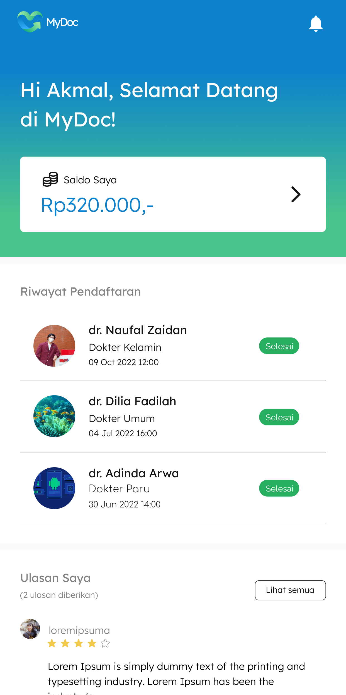

<!-- PROJECT LOGO -->
<br />
<div align="center">
  <a href="https://github.com/codernewbie04/MyDoc">
    
  </a>

  <h3 align="center">MyDoc</h3>

  <p align="center">
    MyDoc is a mobile application that makes it easy for its users to queue up for healthcare services. With MyDoc, you can easily search for the nearest hospital or clinic that offers the services you need, make appointments with doctors, and monitor your position in the queue
    <br />
    <br />
    <a href="https://akmalmf.my.id/mydoc.apk">View Demo</a>
    ·
    <a href="https://github.com/codernewbie04/MyDoc/issues">Report Bug</a>
    ·
    <a href="https://github.com/codernewbie04/MyDoc/issues">Request Feature</a>
  </p>
</div>

## You need to Know

MyDoc is divided into two applications: a mobile application (Project Location: /android) and a web application (Project Location: /website). The mobile application is used by patients to find hospitals or clinics, make appointments with doctors, pay for services, and so on. The web application, on the other hand, is used by health agencies and their administrators. The super admin can use the web application to add health agencies and monitor patients, while health agencies can use it to add doctors and confirm queues

### Built With
* 
* 
* 
* 


## Getting Started
To get a local copy up and running follow these simple example steps.
### Prerequisites
Installed  `composer`, `Android Studio`, and `Web Server`
### Website Installation
1. Get a free API Key for Payment Gateway at [https://www.duitku.com](https://www.duitku.com)
2. Clone the repo
   ```sh
   git clone https://github.com/codernewbie04/MyDoc.git
   ```
3. Go to website folder
   ```sh
   cd MyDoc/website
   ```
4. Install composer packages
   ```sh
   composer install
   ```
5. Import database `mydoc.sql`
6. Edit your .env, sample in `env_example`
7. Replace `MERCHANT_CODE` and `DUITKU_APIKEY` to your Duitku Apikey
8. Start the server
   ```sh
   php spark serve
   ```

### Android Installation
1. Open `Android Studio`
2. Open Project and point android studio to MyDoc/android folder
3. Edit BASE_URL in your build.gradle (Inside app folder) to your local IP web server


## Preview
<div align="center">




</div>


## Learn More

To learn more about Android Studio and Codeigniter 4, take a look at the following resources:

- [Android Studio Documentation](https://developer.android.com/docs) - learn about Android Studio.
- [Codeigniter 4 Documentation](https://codeigniter.com/user_guide/intro/index.html) - learn about Codeigniter 4.


